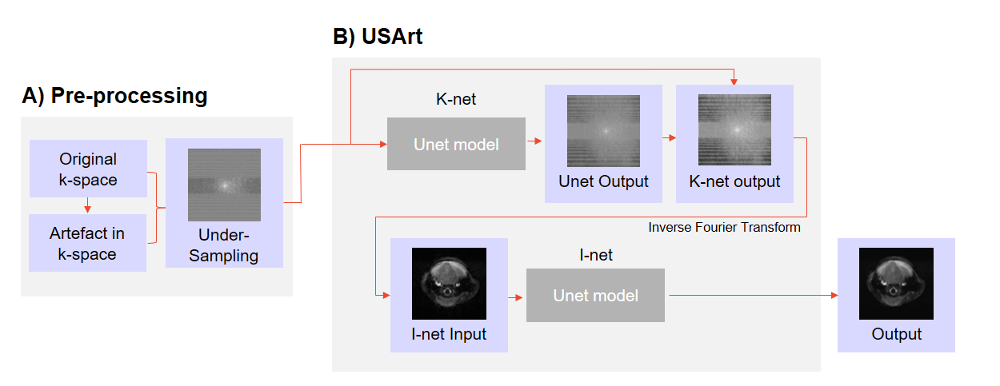

# USArt

This repository contains USArt code for the paper: 
> G. Kanli, D. Perlo, S. Boudissa, R. Jirik  and O. Keunen.
> "Simultaneous Image Quality Improvement and Artefacts Correction in Accelerated MRI", 2024 MICCAI Workshop on Deep Generative Models, Marrakech, Morocco, 2024 (will be updated once paper published in proceedings ).

This paper was accepted to the **27th MICCAI Workshop on Deep Generative Models** . You can find the poster presented to the [MICCAI Workshop](https://conferences.miccai.org/2024/en/workshops.asp) conference under [*Poster_MLMI24_60.pdf*](https://github.com/TransRad/USArt/blob/main/Poster_MLMI24_60.pdf).

## Description
The preprocessing pipeline and USArt. A) Artifacts and noise are added to full k-space, before under-sampling is performed using specific masks and acceleration
factors. This degraded k-space dataset is used as input for the USArt model. B) USArt utilizes two U-Net based components: K-net and I-net. K-net operates in the k-space
domain to fill missing lines, and its output is transformed to the image domain via an inverse Fourier Transform. I-net then refines this output, focusing on artifacts correc-
tion and image consistency.

## Getting started
### Requirements

In order to use the library you need to install the following packages:
- pip install matplotlib
- pip install numpy
- pip install pydicom
- pip install scipy
- pip install skimage

#You can find instructions on loading the data and utilizing the MRArt library in the Jupyter notebook titled **Examples.ipynb**.

## Support
If you have any questions, feel free to reach out to our support team at imaging@lih.lu.

## Roadmap
We plan to introduce a 3D version of the library in the future, featuring additional degradation types.

## Authors
Georgia KANLI, Daniele PERLO, Selma BOUDISSA, Radovan JIRIK and Olivier KEUNEN.

## Citation 
If you find **USArt** useful in your research, please use the following for citation.

G. Kanli, D. Perlo, S. Boudissa, Radovan Jirik  and O. Keunen. "Simultaneous Image Quality Improvement and Artefacts Correction in Accelerated MRI", 2024 MICCAI Workshop on Deep Generative Models, Marrakech, Morocco, 2024 (will be updated once paper published in proceedings )

