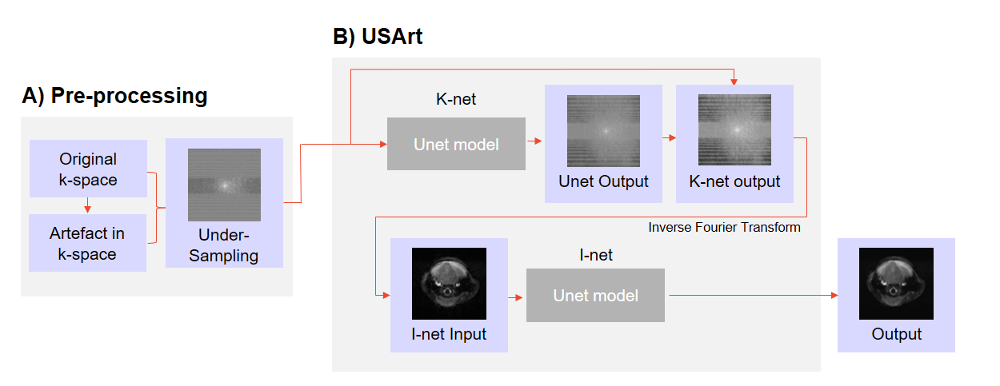
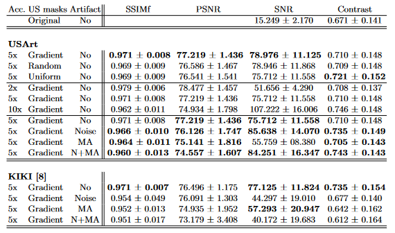
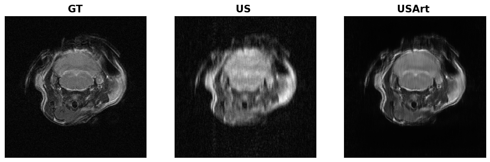

# USArt

This repository contains USArt code for the paper: 
> G. Kanli, D. Perlo, S. Boudissa, R. Jirik  and O. Keunen.
> "Simultaneous Image Quality Improvement and Artefacts Correction in Accelerated MRI", 2024 MICCAI Workshop on Deep Generative Models, Marrakech, Morocco, 2024 (will be updated once paper published in proceedings ).

This paper was accepted to the **27th MICCAI Workshop on Deep Generative Models** . You can find the poster presented to the [MICCAI Workshop](https://conferences.miccai.org/2024/en/workshops.asp) conference under [*Poster_MLMI24_60.pdf*](https://github.com/TransRad/USArt/blob/main/Poster_MLMI24_60.pdf).

## Description
The preprocessing pipeline and USArt. A) Artifacts and noise are added to full k-space using our [**MRArt** library](https://github.com/TransRad/MRArt), before under-sampling is performed using specific masks and acceleration factors. This degraded k-space dataset is used as input for the USArt model. B) USArt utilizes two U-Net based components: K-net and I-net. K-net operates in the k-space domain to fill missing lines, and its output is transformed to the image domain via an inverse Fourier Transform. I-net then refines this output, focusing on artifacts correction and image consistency.

Performance of our USArt model with various under-sampling strategies, acceleration factors, and artefacts. The first three lines compare USArt performance with different under-sampling strategies. The next three lines show USArt performance with different acceleration factors. The next 4 lines show the robustness of USArt to the presence of artefacts. The bottom part of the table provides benchmark values for the reference KIKI model using a 5x acceleration factor and gradient under-sampling in the presence of artifacts, showing the superiority of our model in real-world acquisitions.

Example of USArt: You can predict the USArt model on loading your in the Jupyter notebook titled **USArtPediction.ipynb**

## Getting started
### Requirements

In order to use the library you need to install the following packages:
- pip install bunch
- pip install sewar
- pip install numpy
- pip install matplotlib
- pip install pycopy-copy
- pip install os-sys
- pip install random2
- pip install keras
- pip install DateTime
- pip install jsonlib
- pip install tensorflow
- pip install tensorflow-addons
- pip install scipy
- pip install functools

You can predict the USArt model on loading your in the Jupyter notebook titled **USArtPediction.ipynb**.

## Support
If you have any questions, feel free to reach out to our support team at imaging@lih.lu.

## Roadmap
Having established confidence in the model's capacity to manage simultaneous under-sampling and artefact correction, future research could explore alternative model architectures such as Vision Transformers. These architectures, proven effective in image-to-image translation tasks, hold promise for enhancing our USArt. Moreover, our approach is also applicable to accelerating clinical data and other types of trajectories and more advanced protocols, where various types of artefacts may be observed.

## Authors
Georgia KANLI, Daniele PERLO, Selma BOUDISSA, Radovan JIRIK and Olivier KEUNEN.

## Citation 
If you find **USArt** useful in your research, please use the following for citation.

G. Kanli, D. Perlo, S. Boudissa, Radovan Jirik  and O. Keunen. "Simultaneous Image Quality Improvement and Artefacts Correction in Accelerated MRI", 2024 MICCAI Workshop on Deep Generative Models, Marrakech, Morocco, 2024 (will be updated once paper published in proceedings )

